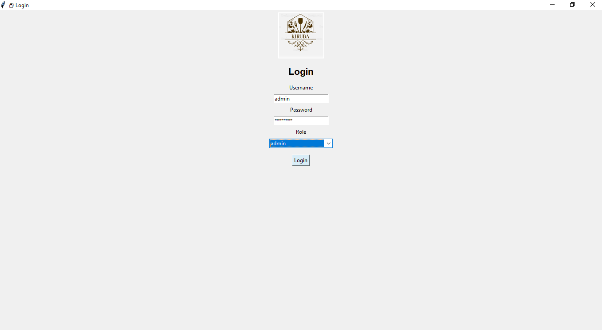
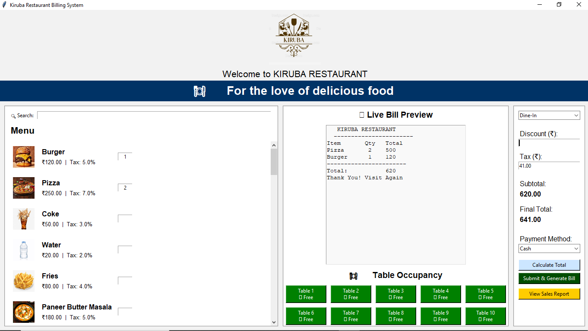
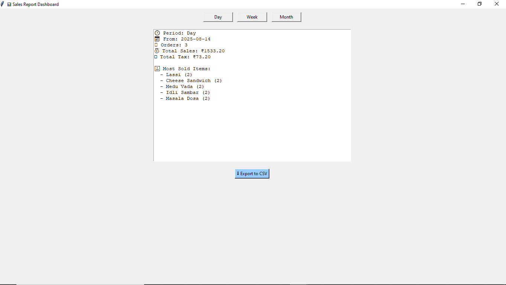
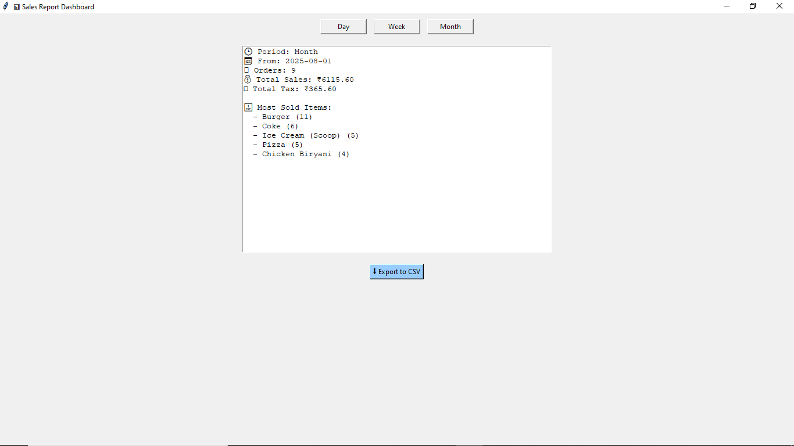
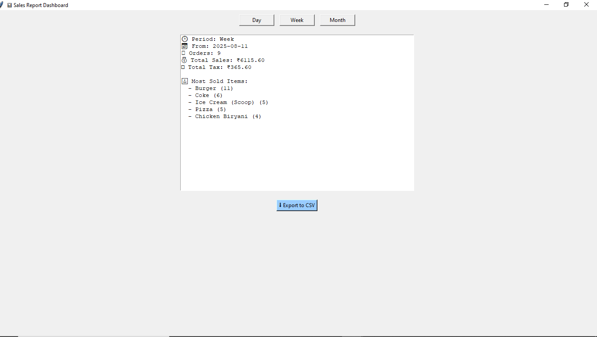
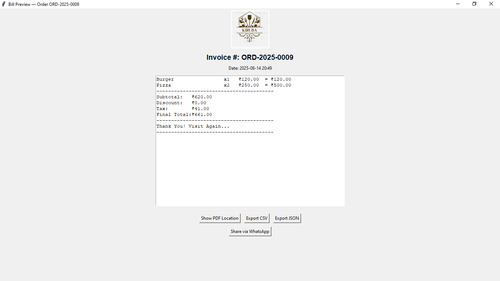

# Restaurant-Billing-Software
-----------------------------

🍽️ Kiruba Restaurant Billing System

A Tkinter-based restaurant billing and table management system for Kiruba Restaurant.
This app helps manage dine-in, takeaway orders, generate bills, track table occupancy, and view sales summaries — all in a clean, interactive interface.

📌 Features
----------------
1. Restaurant Branding

Restaurant logo displayed at the top.

Customizable restaurant name in bill headers.

2. Menu & Order Management

Scrollable menu with categories and items.

Search bar for quick menu filtering.

Add items to the bill with one click.

Supports Dine-In and Takeaway order modes.

3. Live Bill Preview

Shows items, quantity, and total price in a receipt-style layout.

Updates instantly as items are added or removed.

Example bill format:

KIRUBA RESTAURANT
-----------------------
Item       Qty   Total
Pizza       2    500
Burger      1    120
-----------------------
Total:           620
Thank You! Visit Again

4. Table Occupancy Management

20 tables displayed in a grid.

Green = Free, Red = Occupied.

Clicking a free table marks it as occupied and links it to a bill.

Auto-free tables after a set time (5, 10, or 15 minutes depending on order duration).

5. Billing & Payments

Add discounts and tax.

Calculate totals automatically.

Supports Cash, Card, UPI payment methods.

Generates printable PDF bills.

Option to export bills in CSV format.

6. Sales Dashboard

View total bills for the day.

See total revenue and top-selling items.

🛠️ Technologies Used
----------------------

Python 3.x

Tkinter (GUI)

Pillow (PIL) – for image/logo handling.

SQLite – for storing menu items and sales records.

ReportLab – for PDF bill generation.

📂 Project Structure
----------------------
kiruba_restaurant/
│
├── app.py                # Main application file
├── billing.py             # PDF bill generation functions
├── sales_dashboard.py     # Sales reporting module
├── kiruba.png             # Restaurant logo
├── menu.db                # SQLite database with menu items
├── requirements.txt       # Python dependencies
└── README.md              # Project documentation

⚙️ Installation & Setup
--------------------------
1. Clone the Repository
git clone https://github.com/yourusername/kiruba-restaurant-billing.git
cd kiruba-restaurant-billing

2. Install Dependencies
pip install -r requirements.txt

3. Run the Application
python app.py

📸  screenshots 
-----------------

.

.

.

.

.

.

Main Interface:

Left: Menu with search.

Middle: Live bill preview + Table occupancy view.

Right: Billing controls.

Table Occupancy View:

🟢 Free → Available.

🔴 Occupied → Linked to an active bill.

🔄 Workflow

Select Table → marks as occupied.

Add Items → from the left menu.

Preview Bill → middle panel updates live.

Apply Discount/Tax → right panel.

Choose Payment Method → cash, card, UPI.

Generate PDF Bill → prints final bill.

Table Auto Free → returns to green after set time.

📌 Future Enhancements
-------------------------

Kitchen order display system (KDS) integration.

Staff login and role management.

Inventory tracking.

Mobile/tablet responsive version.

👨‍💻 Author
----------

Kiruba Nantham G.C.
Passionate about creating efficient business tools for restaurants.

📧 Email: kirubananthamg.c.1b.m@gmail.com
📍 Location: India

